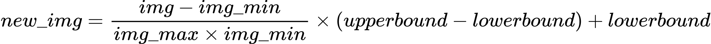
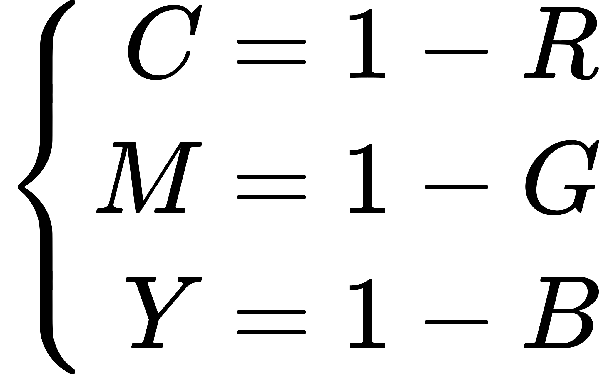

# 密碼學期末專題實做

**目標**：實做一個加解密系統\
**所選系統**：來自[link](https://cccisa.ccisa.org.tw/article/view/1901/0#:~:text=%E5%82%B3%E7%B5%B1%E7%9A%84%E5%8A%A0%E5%AF%86%E6%B3%95%E9%9C%80%E8%A6%81,%E9%9A%B1%E8%97%8F%E7%9A%84%E6%A9%9F%E5%AF%86%E8%A8%8A%E6%81%AF%E3%80%82)

## 實做方法

使用 python 作為程式語言，並且使用 opencv-python 作為主要的函式庫用於處理影像

## 使用說明
### encryption
在 "自主/resource_image" 的資料節夾下放入: C1.png C2.png & S.png/
其中 C1.png & C2.png 為分享影像之基礎/
而 S.png 為機密圖像/ 
執行 encryption.py 即可看到在  "自主/result_image" 下產生 Share1.png & Share2.png

### decrption
在有Share1.png & Share2.png 存在於 "自主/result_image" 下時/
直接執行decryption.py 即可穫得解碼影像

## 實做說明 


### process_images 為整個加密的流程控制

```python
def process_images(C1, C2, S, CT1, CT2, ST1, ST2):

    T = (CT1 + CT2) / 2

#######################################  對 C1 C2 & S (image) 調整範圍 
    C1_adj = adjust_levels(C1, CT1, CT2)
    C2_adj = adjust_levels(C2, CT1, CT2)
    S_adj = adjust_levels(S, ST1, ST2)

#######################################  對 C1 C2 & S (image) 做 CMY 轉換 
    C1C, C1M, C1Y = to_cmy(C1_adj)
    C2C, C2M, C2Y = to_cmy(C2_adj)
    SC, SM, SY = to_cmy(S_adj)
    OC1C, OC1M, OC1Y = C1C.copy(), C1M.copy(), C1Y.copy()
    OC2C, OC2M, OC2Y = C2C.copy(), C2M.copy(), C2Y.copy()

####################################### 對SM SY SC  做 halftone + error diffusion 
    SC = halftone(SC)
    SM = halftone(SM)
    SY = halftone(SY)

####################################### 對  C1 & C2  做調整，並且每次調整後對該位元進行 error_diffusion  
    for channel1, channel2, S_channel, OOasd1, OOasd2 in [(C1C, C2C, SC, OC1C, OC2C), (C1M, C2M, SM, OC1M, OC2M), (C1Y, C2Y, SY, OC1Y, OC2Y)]:
        for i in range(SC.shape[0]):
            for j in range(SC.shape[1]):
                if S_channel[i, j] == 255:
                    channel1[i, j] = 255
                    channel2[i, j] = 255
                elif S_channel[i, j] == 0:
                    if channel1[i, j] >= T and channel2[i, j] >= T:
                        if channel1[i, j] > channel2[i, j]:
                            channel1[i, j], channel2[i, j] = 255, 0
                        else:
                            channel1[i, j], channel2[i, j] = 0, 255
                    elif channel1[i, j] >= T:
                        channel1[i, j], channel2[i, j] = 255, 0
                    elif channel2[i, j] >= T:
                        channel1[i, j], channel2[i, j] = 0, 255
                    else:
                        channel1[i, j], channel2[i, j] = 0, 0
            
                channel1 = error_diffusion(channel1, OOasd1, i, j)
                channel2 = error_diffusion(channel2, OOasd2, i, j)


    Share1 = merge_image(C1C, C1M, C1Y)
    Share2 = merge_image(C2C, C2M, C2Y)

    return Share1, Share2
```


### 對 C1 C2 & S (image) 調整範圍  

```python
def adjust_levels(image, lower, upper):
    img_min = np.min(image) #0
    img_max = np.max(image) #255
    adjusted = (image - img_min) / (img_max - img_min) * (upper - lower) + lower
    return adjusted
```

透過將圖片使用以下公式調整到 upper & lower 之間



### 對 C1 C2 & S (image) 做 CMY 轉換 

```python
def to_cmy(image):
    cmy = 255 - image
    return cmy[:, :, 0], cmy[:, :, 1], cmy[:, :, 2]
```


**CMY轉換公式**

\
而因為這裡的 RGB 值域為0~255 因此將 1 改為 255  

### 對SM SY SC  做 halftone + error diffusion 

```python 
def halftone(image):
    image = image.astype(np.float32)
    rows, cols = image.shape
    for y in range(rows):
        for x in range(cols):
            old_pixel = image[y, x]
            new_pixel = 255 if old_pixel > 128 else 0
            image[y, x] = new_pixel
            quant_error = old_pixel - new_pixel

            if x + 1 < cols:
                image[y, x + 1] += quant_error * 7 / 16
            if y + 1 < rows:
                image[y + 1, x] += quant_error * 5 / 16
                if x - 1 >= 0:
                    image[y + 1, x - 1] += quant_error * 3 / 16
                if x + 1 < cols:
                    image[y + 1, x + 1] += quant_error * 1 / 16

    return image
```
1.  遍歷 $pixels_{i,j}$ 
2. 對 $pixels_{i,j}$ 進行 halftone
3. 對 $pixels_{i,j}$ 進行 error_diffusion


#### error diffusion Matrix
使用 Steinberg kernel

$$
\frac{1}{16}
\begin{bmatrix}
  & \times & 7 \\
 3 & 5 & 1 &
\end{bmatrix}
$$

###  對  C1 & C2  做調整，並且每次調整後對該位元進行 error_diffusion  